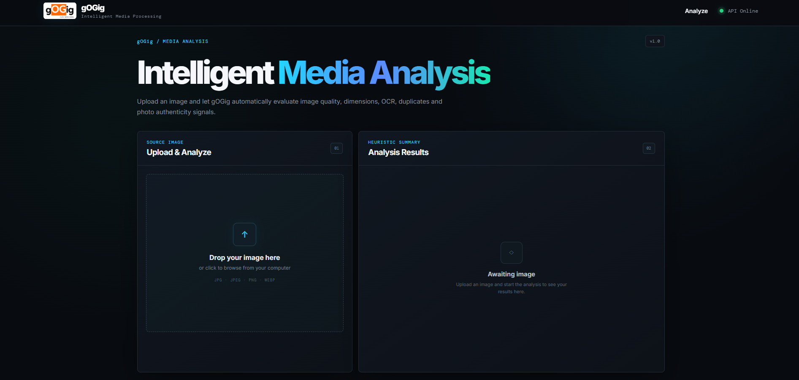
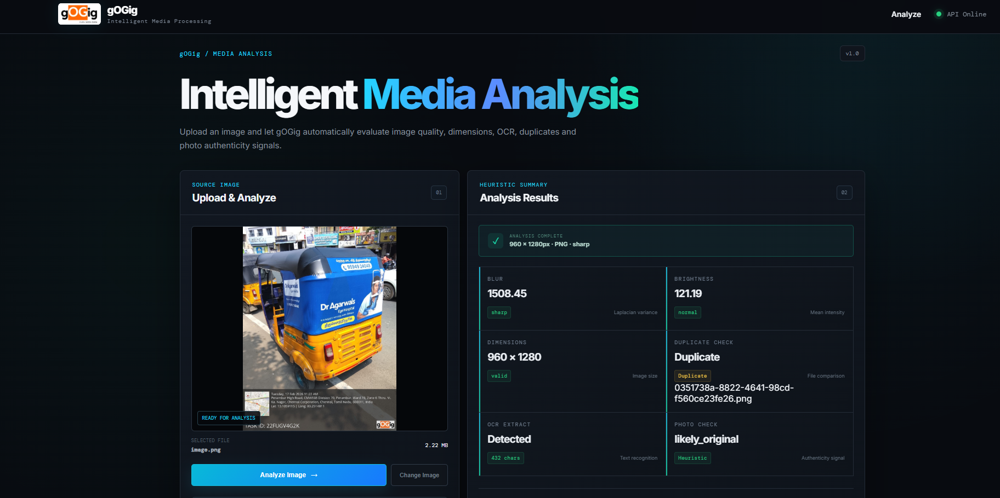

# gOGig Intelligent Media Processing

A full-stack media analysis application built for the gOGig technical assignment.

The application allows users to upload an image and automatically analyze it for image quality, dimensions, duplicate files, and photo authenticity signals.

---

## Live Demo

### Frontend

https://gogig-media-processing-frontend.onrender.com

### Backend API

https://gogig-media-processing.onrender.com

### API Health Check

https://gogig-media-processing.onrender.com/

---

## Overview

gOGig Intelligent Media Processing is a web-based image analysis system designed to process uploaded images and provide useful quality and authenticity signals.

The system provides:

- Image upload and preview
- Image dimension validation
- Blur/sharpness detection
- Brightness analysis
- Duplicate image detection
- Photo-of-photo heuristic detection
- Processing status tracking
- Processing metadata
- Issue reporting and recommendations
- Persistent processing information using MongoDB

The frontend communicates with a FastAPI backend, while MongoDB is used for persistent storage.

---

# Features

## 1. Image Upload

Users can upload image files directly through the web interface.

Supported formats include:

- JPG
- JPEG
- PNG
- WEBP

The selected image is displayed in the interface before analysis.

### Upload Interface



---

## 2. Image Quality Analysis

The backend evaluates image quality using image-processing techniques.

### Blur Detection

The application calculates a sharpness/blur score using Laplacian variance.

A higher variance generally indicates stronger edges and a sharper image.

The result is presented as:

- Sharp
- Blurry

### Brightness Analysis

The system calculates the average image intensity to determine whether the image has a reasonable brightness level.

The result can indicate states such as:

- Normal
- Dark
- Bright

---

## 3. Dimension Validation

The uploaded image dimensions are analyzed and displayed.

Example:

```text
960 × 1280
---

## 4. Duplicate Detection

The application checks whether an uploaded image has already been processed.

If the image has not been seen before:

```text
Duplicate Check → Unique
If the same image has already been processed:
Duplicate Check → Duplicate
The interface also generates an issue report when a duplicate is detected.

---

## 5. Photo Authenticity Heuristic

The application performs heuristic checks to identify possible:

- Photos of photos
- Screen captures
- Re-photographed images

The result is presented as an authenticity signal rather than a definitive classification.

Example:

```text
likely_original
or:
possible_photo_of_photo
---

## 6. Processing Information

Each completed analysis displays processing metadata including:

- File format
- Aspect ratio
- Processing ID
- Processed timestamp

Example:

```text
FILE FORMAT
PNG

ASPECT RATIO
0.75

PROCESSING ID
<generated processing ID>

PROCESSED AT
<processing timestamp>
---

## 7. Issue Reporting

The application summarizes detected issues and provides a recommendation.

For example, when a duplicate image is detected:

```text
Duplicate image detected

Recommendation:
Manual review recommended---

## 8. Analysis Results

The completed analysis displays the main quality and authenticity signals together.

The result dashboard includes:

- Blur score
- Brightness score
- Image dimensions
- Duplicate status
- Image analysis status
- Photo authenticity signal
- Processing information

### Analysis Results

---

# System Architecture

```text
                    ┌─────────────────────┐
                    │       User          │
                    │      Browser        │
                    └──────────┬──────────┘
                               │
                               │ HTTPS
                               ▼
              ┌─────────────────────────────┐
              │       React Frontend        │
              │                             │
              │  Upload & Analyze           │
              │  Results Dashboard          │
              │  Issue Reporting            │
              └──────────────┬──────────────┘
                             │
                             │ REST API
                             ▼
              ┌─────────────────────────────┐
              │       FastAPI Backend       │
              │                             │
              │  Image Upload               │
              │  Processing Pipeline        │
              │  Quality Analysis           │
              │  Duplicate Detection        │
              │  Authenticity Heuristics    │
              └──────────────┬──────────────┘
                             │
                             ▼
              ┌─────────────────────────────┐
              │          MongoDB            │
              │                             │
              │  Processing Records         │
              │  Image Metadata             │
              │  Analysis Results           │
              └─────────────────────────────┘---

# Technology Stack

## Frontend

- React
- Vite
- JavaScript
- CSS

## Backend

- Python
- FastAPI
- Uvicorn
- REST API

## Database

- MongoDB
- PyMongo

## Image Processing

- Python image-processing libraries
- OpenCV-based image analysis

## Deployment

- Render
- GitHub---

# Project Structure

```text
gogig-media-processing/
│
├── frontend/
│   ├── src/
│   │   ├── App.jsx
│   │   ├── App.css
│   │   └── ...
│   │
│   ├── package.json
│   └── ...
│
├── main.py
├── database.py
├── requirements.txt
├── Dockerfile
├── README.md
│
└── screenshots/
    ├── analysis.png
    ├── issue-report.png
    └── upload.png---

# API

## Health Check

```http
GET /GET /images/{processing_id}/status
GET /images/{processing_id}/results---

# Processing Flow

```text
1. User selects an image
          ↓
2. Frontend uploads image
          ↓
3. FastAPI receives the image
          ↓
4. Processing ID is generated
          ↓
5. Image analysis starts
          ↓
6. Quality checks are performed
          ↓
7. Duplicate detection is performed
          ↓
8. Authenticity heuristics are evaluated
          ↓
9. Results are stored in MongoDB
          ↓
10. Frontend polls processing status
          ↓
11. Completed results are displayed---

---

# Environment Variables

The backend requires the following environment variable:

```text
MONGODB_URL---

# Deployment

The application is deployed using Render.

## Backend

The FastAPI backend is deployed as a web service.

```text
https://gogig-media-processing.onrender.com
The React frontend is deployed separately.
https://gogig-media-processing-frontend.onrender.com
---

# Testing

The deployed application was tested using multiple image scenarios.

## Test 1 — Unique Image

A new image that had not previously been processed was uploaded.

Expected result:

```text
Duplicate Check → Unique
Blur → Blurry

---

# Design Approach

The interface follows a two-panel analysis workflow.

```text
┌──────────────────────┬────────────────────────┐
│                      │                        │
│   Source Image       │   Analysis Results     │
│                      │                        │
│   Upload             │   Blur                 │
│   Preview            │   Brightness            │
│   Analyze            │   Dimensions            │
│   Issue Report       │   Duplicate             │
│                      │   Image Summary         │
│                      │   Photo Check            │
│                      │   Processing Info       │
│                      │                        │
└──────────────────────┴────────────────────────┘

---

# Security Considerations

- MongoDB credentials are stored through environment variables.
- Database connection strings are not committed to the repository.
- The frontend communicates with the backend through HTTPS in production.
- CORS is configured for the deployed frontend.
- API processing uses generated processing IDs for tracking individual jobs.
---

# Future Improvements

Possible future improvements include:

- More advanced OCR support
- Additional image authenticity signals
- Better duplicate similarity detection
- Image compression analysis
- More detailed quality scoring
- Authentication and user accounts
- Batch image processing
- Background task queues for larger workloads
- Improved monitoring and logging

---

# Conclusion

gOGig Intelligent Media Processing provides a complete image-analysis workflow from upload to processed results.

The project combines:

- React
- FastAPI
- Python image processing
- MongoDB
- REST APIs
- Asynchronous processing
- Render deployment

The deployed system has been tested with unique, duplicate, and blurry images and successfully produces the corresponding analysis results and issue reports.